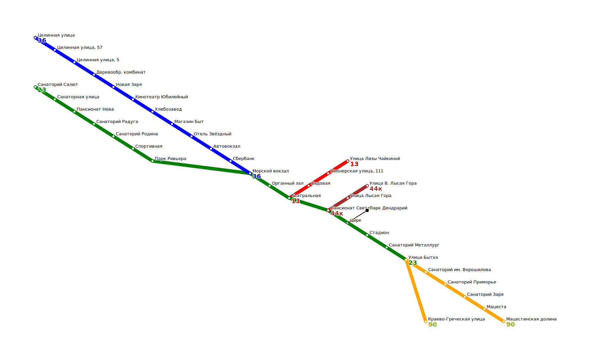

# Transport Catalogue (C++) <!-- omit in toc -->

Каталог остановок и автобусных маршрутов с JSON-вводом/выводом, SVG-картой и поиском кратчайших путей по графу ([алгоритм Дейкстры](https://ru.wikipedia.org/wiki/Алгоритм_Дейкстры), учёт ожидания и скорости).



## Содержание <!-- omit in toc -->
- [Возможности](#возможности)
- [Архитектура](#архитектура)
- [Сборка](#сборка)
- [Запуск](#запуск)
- [Формат данных](#формат-данных)
- [Примеры](#примеры)
- [Лицензия](#лицензия)

## Возможности
- Импорт базы: остановки, расстояния, маршруты (`base_requests`).
- Запросы (`stat_requests`):
  - **Bus** — длина, извилистость, кол-во остановок/уникальных.
  - **Stop** — маршруты через остановку.
  - **Route** — кратчайший путь (Wait/Bus шаги, общее время).
  - **Map** — SVG-карта.
- Настройки: `render_settings` (карта), `routing_settings` (скорость/ожидание).
- CLI: читает из **stdin**, пишет в **stdout**. Без внешних зависимостей.

## Архитектура


* **`main.cpp`** — точка входа: инициализация, чтение `stdin`, вывод `stdout`.
* **`json_reader`** — парсинг входных данных и вызов фасада.
* **`request_handler`** — фасад, связывающий все слои приложения.
* **`transport_catalogue`** — хранение остановок, маршрутов и расстояний.
* **`transport_router`**, **`router`**, **`graph`** — построение графа и поиск маршрутов.
* **`map_renderer`** — генерация SVG-карты маршрутов.
* **`json`**, **`json_builder`**, **`svg`** — внешние библиотеки для работы с форматами.
* **`domain`**, **`geo`** — базовые сущности и геометрия.
* **`ranges`** — утилиты для работы с коллекциями.

## Сборка
**Требования:** компилятор с C++17 (GCC/Clang/MinGW).

**Windows (CMD)**
```bat
g++ -std=c++17 src\*.cpp -o transport-catalogue.exe
```

**Linux/macOS**
```bash
g++ -std=c++17 src\*.cpp -o transport-catalogue.exe
```

> Релиз: добавить `-O2 -DNDEBUG`. Отладка: `-g -O0 -Wall -Wextra`.

## Запуск

**Windows (CMD)**
```bat
.\transport-catalogue.exe < .\input.json > .\output.json
```
**Linux/macOS**
```bash
./transport-catalogue < input.json > output.json
```

## Формат данных

Во входном JSON ожидаются разделы:

* **`base_requests`** — `Stop` (lat/lng + `road_distances`) и `Bus` (`stops[]`, `is_roundtrip`).
* **`render_settings`** — размеры, отступы, палитра, шрифты, толщины.
* **`routing_settings`** — `bus_wait_time` (мин), `bus_velocity` (км/ч).
* **`stat_requests`** — массив запросов типов **Bus** / **Stop** / **Route** / **Map**.

## Примеры

## Лицензия
MIT — см. файл [LICENSE](LICENSE).
