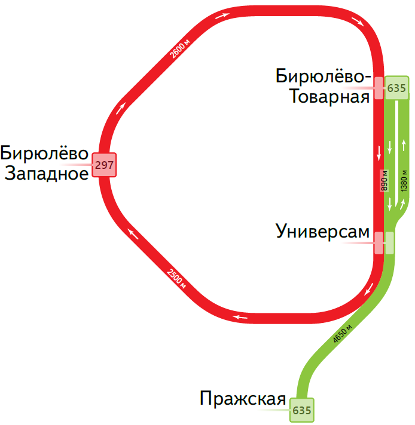
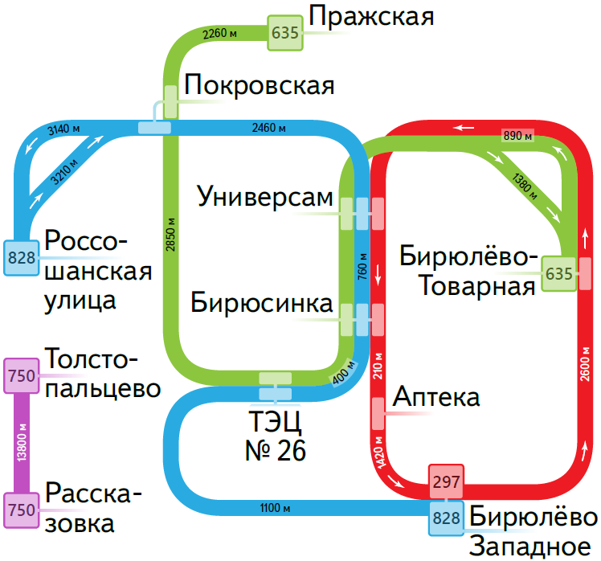

# Transport Catalogue (C++) <!-- omit in toc -->

Каталог остановок и автобусных маршрутов с JSON-вводом/выводом, SVG-картой и поиском кратчайших путей по графу ([алгоритм Дейкстры](https://ru.wikipedia.org/wiki/Алгоритм_Дейкстры), учёт ожидания и скорости).


## Содержание <!-- omit in toc -->
- [Возможности](#возможности)
- [Архитектура](#архитектура)
- [Сборка](#сборка)
- [Запуск](#запуск)
- [Формат данных](#формат-данных)
  - [Вход (input.json)](#вход-inputjson)
    - [Создание базы (`base_requests`)](#создание-базы-base_requests)
    - [Настройки отрисовки (`render_settings`)](#настройки-отрисовки-render_settings)
    - [Настройки маршрутизации (`routing_settings`)](#настройки-маршрутизации-routing_settings)
    - [Запросы (`stat_requests`)](#запросы-stat_requests)
  - [Выход (output.json)](#выход-outputjson)
    - [Общие поля ответа](#общие-поля-ответа)
    - [Ответ на `Bus`](#ответ-на-bus)
    - [Ответ на `Stop`](#ответ-на-stop)
    - [Ответ на `Route`](#ответ-на-route)
    - [Ответ на `Map`](#ответ-на-map)
- [Примеры](#примеры)
  - [Рендер карты и базовые ответы](#рендер-карты-и-базовые-ответы)
  - [Маршрутизация (базовая)](#маршрутизация-базовая)
  - [Маршрутизация (расширенная)](#маршрутизация-расширенная)
- [Лицензия](#лицензия)

## Возможности
- Импорт базы: остановки, расстояния, маршруты ([`base_requests`](#вход-inputjson)).
- Запросы ([`stat_requests`](#запросы-stat_requests)):
  - **Bus** — длина, извилистость, число остановок/уникальных.
  - **Stop** — список маршрутов через остановку.
  - **Route** — кратчайший путь (шаги Wait/Bus, общее время).
  - **Map** — SVG-карта.
- Настройки: [`render_settings`](#настройки-отрисовки-render_settings) (карта), [`routing_settings`](#настройки-маршрутизации-routing_settings) (скорость/ожидание).
- **I/O:** читает JSON из `stdin`, пишет JSON в `stdout` — удобно для пайплайнов (`cat | app | jq`) и CI-тестов.
- **Зависимости:** внешних нет — всё необходимое уже в репозитории (`src/`). Нужен только компилятор с поддержкой C++17.

## Архитектура


* **`main.cpp`** — точка входа: инициализация, чтение `stdin`, вывод `stdout`.
* **`json_reader`** — парсинг входных данных и вызов фасада.
* **`request_handler`** — фасад, связывающий все слои приложения.
* **`transport_catalogue`** — хранение остановок, маршрутов и расстояний.
* **`transport_router`**, **`router`**, **`graph`** — построение графа и поиск маршрутов.
* **`map_renderer`** — генерация SVG-карты маршрутов.
* **`json`**, **`json_builder`**, **`svg`** — внешние библиотеки для работы с форматами.
* **`domain`**, **`geo`** — базовые сущности и геометрия.
* **`ranges`** — утилиты для работы с коллекциями.

## Сборка
**Требования:** компилятор с C++17 (GCC, Clang, MinGW).

```bash
g++ -std=c++17 src/*.cpp -o transport-catalogue
```
- **Релиз:** `-O2 -DNDEBUG`
- **Отладка:** `-g -O0 -Wall -Wextra`

## Запуск
```bash
./transport-catalogue < input.json > output.json
```

* `input.json` — содержит `base_requests`, `render_settings`, `routing_settings`, `stat_requests`.
* `output.json` — JSON-массив ответов на `stat_requests` в том же порядке.

## Формат данных

### Вход (input.json)

Во входном JSON ожидаются разделы:

* `base_requests` — данные об остановках и маршрутах
* `render_settings` — параметры отрисовки SVG-карты
* `routing_settings` — параметры построения маршрутов
* `stat_requests` — запросы к транспортному каталогу

<details>
  <summary><strong>Подробная спецификация входа</strong></summary>

#### Создание базы (`base_requests`)

Массив `base_requests` содержит объекты двух типов — `Stop` и `Bus`.
Сначала добавляются все остановки, затем маршруты.

**Остановки (`Stop`)**

| Поле                    | Тип    | Назначение                          |
| ----------------------- | ------ | ----------------------------------- |
| `type`                  | string | `"Stop"`                            |
| `name`                  | string | Название остановки                  |
| `latitude`, `longitude` | double | Координаты                          |
| `road_distances`        | object | Соседние остановки и расстояния (м) |

```json
{
  "type": "Stop",
  "name": "Рынок",
  "latitude": 55.611087,
  "longitude": 37.20829,
  "road_distances": { "Больница": 1500, "Университет": 3000 }
}
```

**Маршруты (`Bus`)**

| Поле           | Тип    | Назначение                     |
| -------------- | ------ | ------------------------------ |
| `type`         | string | `"Bus"`                        |
| `name`         | string | Название маршрута              |
| `stops`        | array  | Список остановок               |
| `is_roundtrip` | bool   | `true`, если маршрут кольцевой |

```json
{
  "type": "Bus",
  "name": "14",
  "stops": ["Рынок", "Больница", "Университет", "Рынок"],
  "is_roundtrip": true
}
```

#### Настройки отрисовки (`render_settings`)

| Поле                   | Тип            | Назначение                          |
| ---------------------- | -------------- | ----------------------------------- |
| `width`, `height`      | double         | Размеры карты                       |
| `padding`              | double         | Отступ от краёв                     |
| `stop_radius`          | double         | Радиус кружков остановок            |
| `line_width`           | double         | Толщина линий маршрутов             |
| `bus_label_font_size`  | int            | Размер шрифта маршрутов             |
| `bus_label_offset`     | array          | Смещение подписи маршрута `[x, y]`  |
| `stop_label_font_size` | int            | Размер шрифта остановок             |
| `stop_label_offset`    | array          | Смещение подписи остановки `[x, y]` |
| `underlayer_color`     | string / array | Цвет подложки                       |
| `underlayer_width`     | double         | Толщина подложки                    |
| `color_palette`        | array          | Цвета маршрутов                     |

```json
{
  "width": 1200,
  "height": 600,
  "padding": 50,
  "stop_radius": 5,
  "line_width": 2,
  "bus_label_font_size": 20,
  "bus_label_offset": [7, 15],
  "stop_label_font_size": 10,
  "stop_label_offset": [5, -5],
  "underlayer_color": [255, 255, 255, 0.85],
  "underlayer_width": 3,
  "color_palette": ["green", "red", "blue"]
}
```

#### Настройки маршрутизации (`routing_settings`)

| Поле            | Тип    | Назначение                       |
| --------------- | ------ | -------------------------------- |
| `bus_wait_time` | int    | Ожидание на остановке (мин)      |
| `bus_velocity`  | double | Средняя скорость автобуса (км/ч) |

```json
{
  "bus_wait_time": 6,
  "bus_velocity": 40
}
```

#### Запросы (`stat_requests`)

Массив `stat_requests` принимает элементы типов: `Stop`, `Bus`, `Route`, `Map`.

| Поле   | Тип    | Назначение                            |
| ------ | ------ | ------------------------------------- |
| `id`   | int    | Уникальный идентификатор              |
| `type` | string | `"Stop"`, `"Bus"`, `"Route"`, `"Map"` |
| `name` | string | Название (кроме `"Map"`)              |

```json
[
  { "id": 1, "type": "Stop", "name": "Рынок" },
  { "id": 2, "type": "Bus", "name": "14" },
  { "id": 3, "type": "Map" }
]
```

</details>

### Выход (output.json)
Каждый элемент соответствует запросу и содержит `request_id`.
При ошибке — `error_message: "not found"`.

<details>
  <summary><strong>Подробная спецификация выхода</strong></summary>

Массив JSON-объектов. Каждый элемент соответствует запросу из `stat_requests` и содержит `request_id` (см. `id` во входных данных). Для неизвестных сущностей возвращается `error_message`.

#### Общие поля ответа

| Поле            | Тип    | Назначение                                                               |
| --------------- | ------ | ------------------------------------------------------------------------ |
| `request_id`    | int    | Идентификатор исходного запроса                                          |
| `error_message` | string | Сообщение об ошибке (`"not found"`) — если запрос не может быть выполнен |

#### Ответ на `Bus`

| Поле                | Тип    | Назначение                                |
| ------------------- | ------ | ----------------------------------------- |
| `route_length`      | int    | Длина маршрута по дорогам (м)             |
| `curvature`         | double | Извилистость (длина_дорог / длина_по_гео) |
| `stop_count`        | int    | Всего остановок на маршруте               |
| `unique_stop_count` | int    | Уникальных остановок                      |

```json
{
  "request_id": 1,
  "route_length": 5990,
  "curvature": 1.43,
  "stop_count": 4,
  "unique_stop_count": 3
}
```

Если маршрут не найден:

```json
{ "request_id": 1, "error_message": "not found" }
```

#### Ответ на `Stop`

| Поле    | Тип           | Назначение                           |
| ------- | ------------- | ------------------------------------ |
| `buses` | array<string> | Маршруты, проходящие через остановку |

```json
{
  "request_id": 2,
  "buses": ["297", "635"]
}
```

Если остановка не найдена:

```json
{ "request_id": 2, "error_message": "not found" }
```

#### Ответ на `Route`

| Поле         | Тип            | Назначение                         |
| ------------ | -------------- | ---------------------------------- |
| `total_time` | double         | Суммарное время (мин)              |
| `items`      | array\<object> | Шаги маршрута в порядке выполнения |

Элементы `items` бывают двух типов:

**Wait**

| Поле        | Тип    | Назначение           |
| ----------- | ------ | -------------------- |
| `type`      | string | `"Wait"`             |
| `stop_name` | string | Остановка ожидания   |
| `time`      | double | Время ожидания (мин) |

**Bus**

| Поле         | Тип    | Назначение                             |
| ------------ | ------ | -------------------------------------- |
| `type`       | string | `"Bus"`                                |
| `bus`        | string | Название маршрута                      |
| `span_count` | int    | Кол-во промежутков (остановок) по пути |
| `time`       | double | Время в пути (мин)                     |

```json
{
  "request_id": 5,
  "total_time": 8.5,
  "items": [
    { "type": "Wait", "stop_name": "Biryulyovo Zapadnoye", "time": 2 },
    { "type": "Bus", "bus": "297", "span_count": 2, "time": 6.5 }
  ]
}
```

Если маршрут построить нельзя:

```json
{ "request_id": 5, "error_message": "not found" }
```

#### Ответ на `Map`

| Поле  | Тип    | Назначение                 |
| ----- | ------ | -------------------------- |
| `map` | string | SVG-документ одной строкой |

```json
{
  "request_id": 12,
  "map": "<svg xmlns=...>...</svg>"
}
```
</details>

## Примеры

### Рендер карты и базовые ответы
* [Входные данные `input.json`](examples/01/input.json)
* [Ожидаемый вывод `output.json`](examples/01/output.json)

**Результирующая карта**
<p align="center">
  
</p>

### Маршрутизация (базовая)
* [Входные данные `input.json`](examples/02/input.json)
* [Ожидаемый вывод `output.json`](examples/02/output.json)

**Иллюстрация схемы маршрутов**


### Маршрутизация (расширенная)
* [Входные данные `input.json`](examples/03/input.json)
* [Ожидаемый вывод `output.json`](examples/03/output.json)

**Иллюстрация схемы маршрутов**


## Лицензия
MIT — см. файл [LICENSE](LICENSE).
